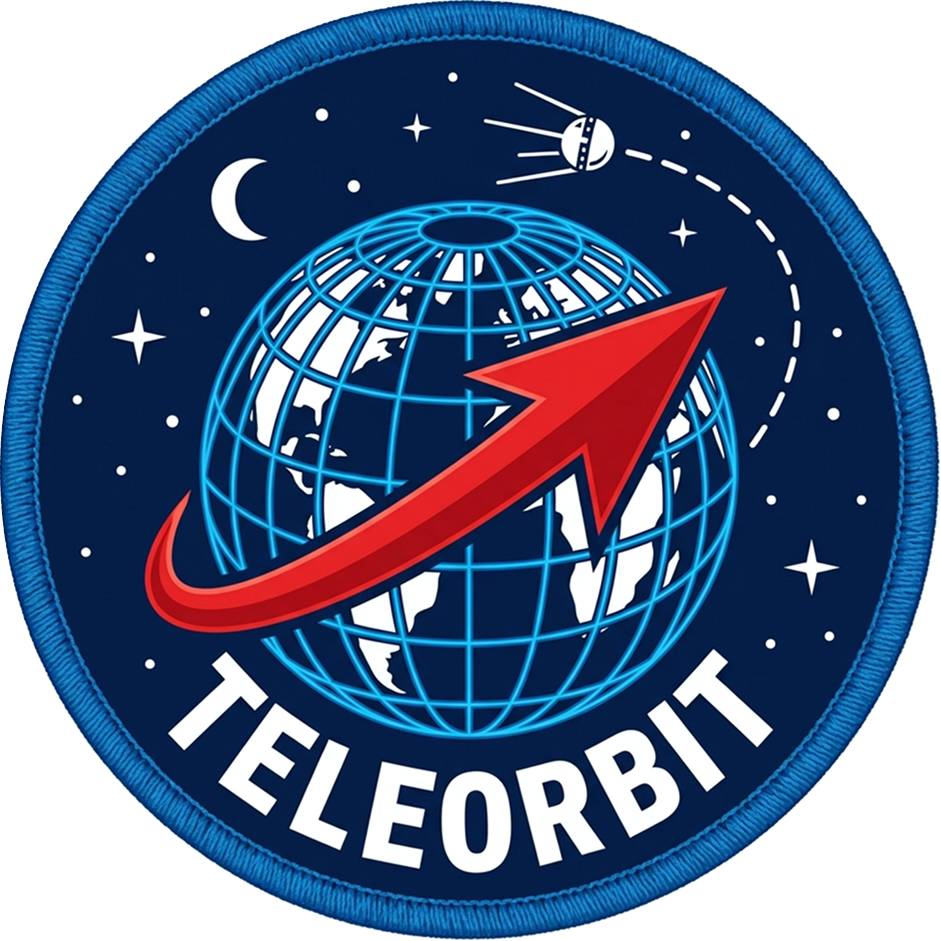

<div align="center">
  
  <h1>Teleorbit</h1>
  <p><strong>CCSDS Space Packet Parser & Orbital State Vector Validator</strong></p>
</div>

---

## Overview

Teleorbit is a minimal, focused C library designed for parsing and validating spacecraft telemetry. It specifically handles the **CCSDS Space Packet Protocol**, which is the foundational data packaging standard used by NASA, ESA, and other space agencies for satellite communications.

This library does two main things:

1. **Parser:** It decodes a raw binary telemetry frame, stripping away the 6-byte CCSDS Space Packet primary header and extracting a 48-byte application data payload (representing an Orbital State Vector in an Earth-Centered Inertial frame).
2. **Validator:** It applies the laws of physics (orbital mechanics) to the extracted position and velocity data to determine if the satellite's reported telemetry is physically possible.

### Why is this needed?

When a ground station receives data from a spacecraft, the data bits travel through space and the atmosphere, meaning corruption can happen. The validator acts as a physics-based firewall. If a satellite reports it is flying below the atmosphere (where it would burn up) or traveling so fast it is escaping Earth's gravity entirely, `teleorbit` flags the data as impossible.

## Features

*   **Bitwise Header Parsing:** Efficiently slices the 6-byte CCSDS header to extract the configuration, version, and APID (Application Process Identifier) using strict bitwise operations.
*   **Network-to-Host conversion:** Safely extracts 6x big-endian 64-bit IEEE 754 doubles representing X,Y,Z position and Vx,Vy,Vz velocity.
*   **Physical Plausibility Checks:**
    *   **Altitude Check:** Rejects telemetry showing an altitude below roughly 150 km, as atmospheric drag makes such orbits unsustainable. It also establishes an upper limit out to the geostationary belt (~42,164 km radius).
    *   **Velocity Check:** Calculates the ideal circular velocity using the Vis-Viva equation at the reported altitude. It expects the actual velocity to be within 50% to 200% of the circular speed.
    *   **Energy Check:** Ensures the specific orbital energy is negative, meaning the satellite is actually bound to Earth and not on an escape trajectory.
*   **Zero Dependencies:** Written in standard C99. No external frameworks, no large dependencies. It compiles instantly and runs fast.

## Usage

You can use the library by linking `ccsds_orbit_validator`. You only need to include two files:

```c
#include "packet.h"
#include "validator.h"

// ... inside your data receive loop ...

// 1. Pass the raw buffer to the parse function
ccsds_packet_t pkt = parse_packet(raw_buffer, buffer_length);

if (pkt.parse_error == PARSE_OK) {
    // 2. Validate the state vector
    validation_result_t res = validate_orbit(&pkt.state);
    
    if (res.passed) {
        printf("Telemetry Valid! Payload altitude: %.3f km\n", res.message);
    } else {
        printf("Physically Implausible Data: %s\n", res.message);
    }
}
```

## Building

The project uses CMake. To build the static library and the demo executable:

```bash
cmake -S . -B build -DCMAKE_BUILD_TYPE=Release
cmake --build build
```

Run the demo validation of an ISS-like LEO packet:
```bash
./build/orbit_validator_demo
```

## Visualization Tool

A web-based visualization tool is available to demonstrate how the physical validation works interactively. You can find it in the `visualize/` directory. Open `visualize/index.html` in your browser.
